# PostJourney

## 📌 Overview
PostJourney is a healthcare recovery and post-discharge assistance platform designed to support patients and caregivers during the recovery journey at home. The application integrates healthcare services, rehabilitation guidance, AI-assisted physiotherapy, and continuous monitoring into a single mobile platform.

The project aims to simplify post-hospital care by helping users access verified caregivers, medical equipment, guided recovery support, and real-time communication features.

---

## 🚀 Features

- 🤖 AI-Assisted Physiotherapy Guidance
- 📊 IoT Wearable Health Monitoring
- 🏥 Medical Equipment Booking
- 💬 Real-Time Chat Consultation
- 👩‍⚕️ Home Nurse & Caretaker Booking
- 👤 Role-Based Dashboards
- 💳 Payment Integration
- 📱 Mobile-Based Recovery Management

---

## 🧠 Technologies Used

### Frontend
- React Native
- Expo

### Backend
- Node.js
- Express.js

### Database
- MongoDB

### AI / Monitoring
- MediaPipe
- Python
- WebRTC

---

## 📂 Project Structure

```bash
PostJourney/
│
├── backend/
│
├── postJourneyMobile/
│
└── postJourneyPoseAPI/
```

---

## ⚙️ Installation & Setup

### 1️⃣ Clone the Repository

```bash
git clone https://github.com/agnusjose/PostJourney.git
cd PostJourney
```

---

# 🔹 Backend Setup

```bash
cd backend
npm install
npm start
```

---

# 🔹 Mobile App Setup

```bash
cd postJourneyMobile
npm install

adb tcpip 5555
adb connect <ip_address>:5555

npx expo run:android
```

---

# 🔹 Pose API Setup

```bash
cd postJourneyPoseAPI

uvicorn webrtc.webrtc_server:app --host 0.0.0.0 --port 8001
```

---

## 📱 Screenshots

> Add screenshots of the application here.

Example:

```markdown
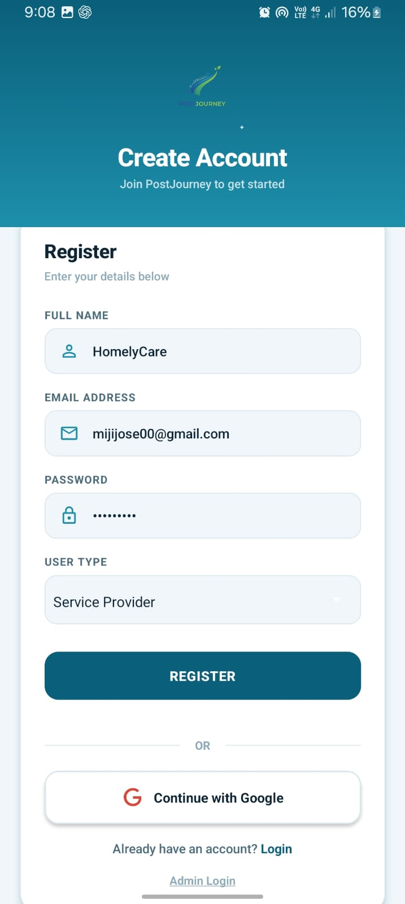
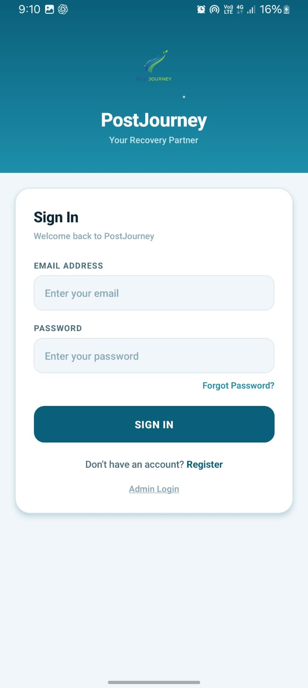
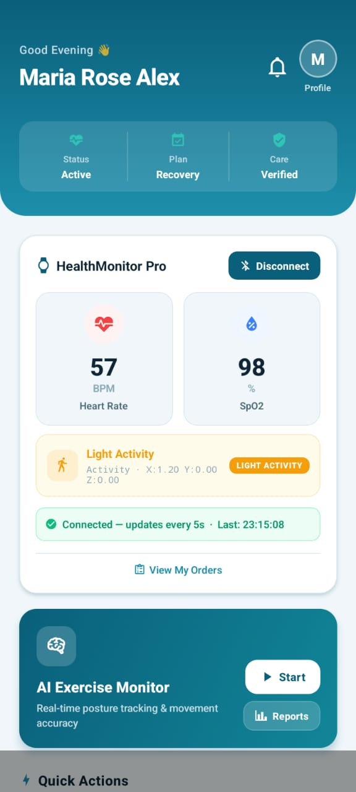
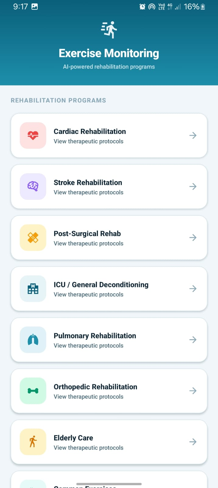

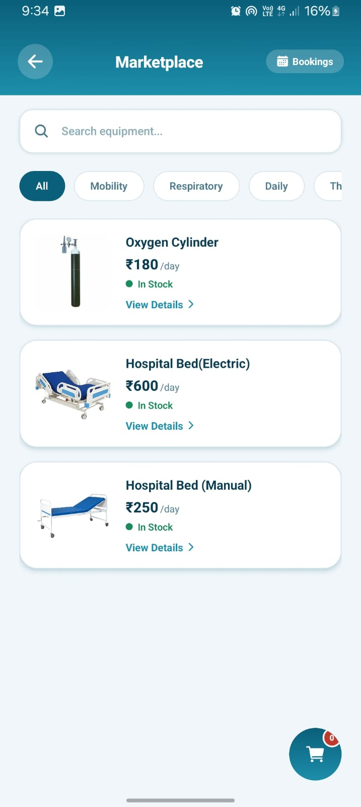
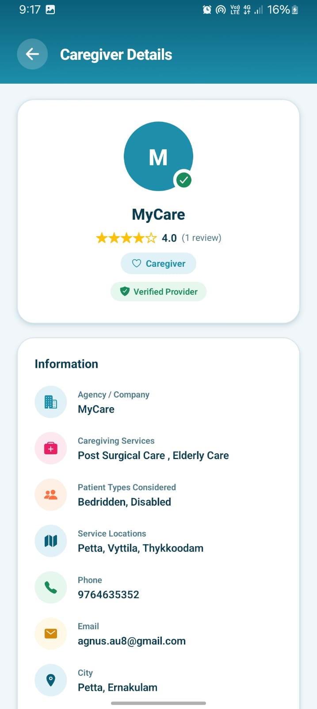
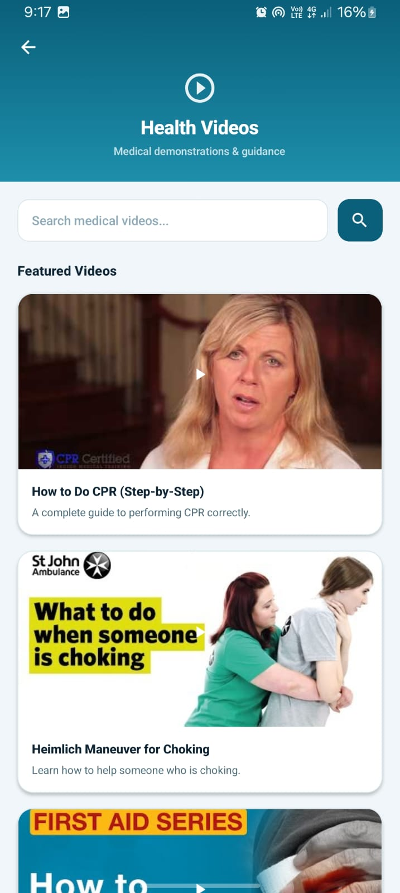
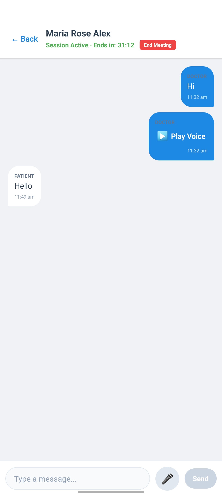
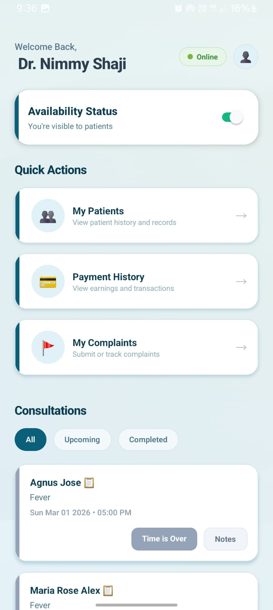
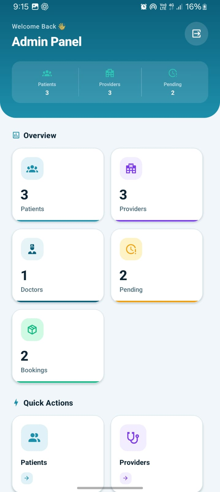
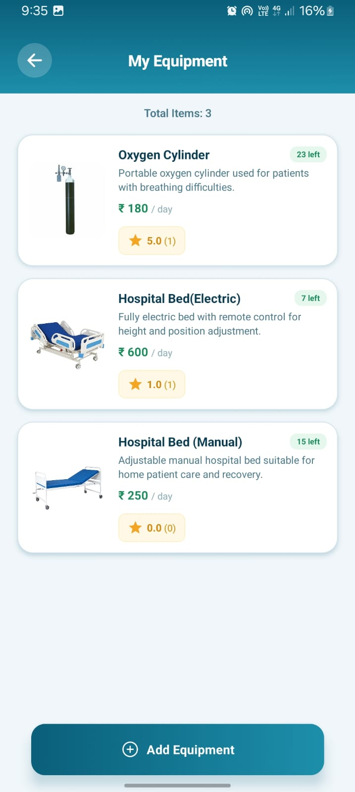
```

---

## 🎯 Problem Statement

Post-discharge patients often struggle to access reliable rehabilitation guidance, continuous monitoring, and verified caregiving services. Caregivers also face difficulty managing recovery routines and arranging trustworthy support services.

PostJourney addresses these challenges by providing:
- Guided rehabilitation assistance
- AI-powered physiotherapy monitoring
- Verified caregiving support
- Integrated communication and monitoring tools

---

## 💡 Proposed Solution

PostJourney provides an integrated digital healthcare ecosystem where patients and caregivers can:
- Access recovery tutorials and physiotherapy guidance
- Monitor health vitals using IoT wearables
- Book verified healthcare support services
- Communicate with doctors through real-time chat
- Manage recovery from a single mobile platform

---

## 🌍 Sustainable Development Goal (SDG)

### SDG 3 – Good Health and Well-Being

PostJourney contributes to improving healthcare accessibility and patient well-being by enabling safer and smarter post-hospital recovery support.

---

## 👥 Team Project

This project was developed as a collaborative team project.

---

## 🔮 Future Enhancements

- Video consultation with doctors
- Emergency SOS system
- Cloud-based health analytics
- Multi-language support
- Smart notifications and reminders

---

## 📌 GitHub Repository

Repository Link:  
https://github.com/agnusjose/PostJourney

---

## ⭐ Support

If you like this project, consider giving it a star on GitHub ⭐
